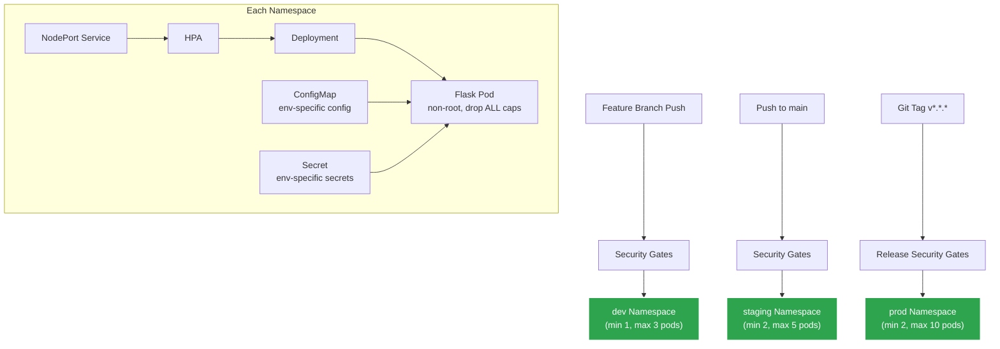
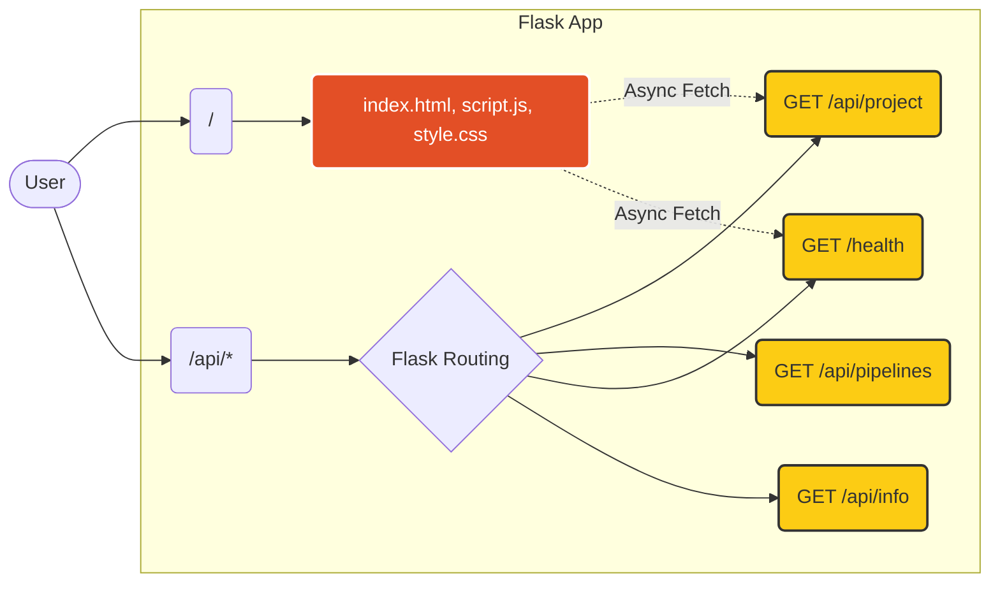
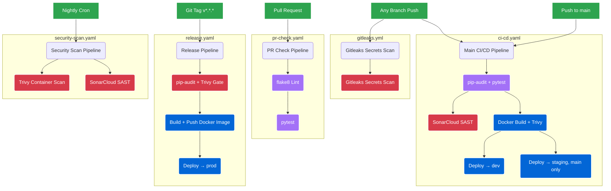

# DevSecOps Flask Project: Comprehensive Architecture & Documentation

## 1. Executive Summary

This project is a complete, production-ready **DevSecOps** showcase built around a cloud-native Python Flask application. It demonstrates the seamless integration of development, security, and operations by implementing a multi-environment Kubernetes deployment, specialised CI/CD pipelines, automated security gates, containerisation, and progressive release promotion.

The primary goal of the project is to illustrate **"Shift-Left" security principles** — catching vulnerabilities, secrets, and code quality issues as early as possible in the development lifecycle, before code reaches any environment.

The architecture now simulates a real **enterprise DevSecOps lifecycle** locally, with three isolated Kubernetes namespaces (`dev`, `staging`, `prod`) through which every release must pass before reaching production.

---

## 2. Multi-Environment DevSecOps Lifecycle

### 2.1 Overview

Most real-world DevSecOps systems enforce a promotion model where code must pass quality and security checks at each stage before advancing to the next. This project implements that model end-to-end:

```
Developer commits code
         │
         ▼
   Feature Branch (dev)
   ┌─────────────────────────────────────┐
   │  Gitleaks  → Secrets scan           │
   │  pip-audit → Dependency CVE scan    │  ← Security Gates
   │  pytest    → Unit tests             │
   │  Trivy     → Container CVE scan     │
   │  SonarCloud→ SAST code analysis     │
   └─────────────────┬───────────────────┘
                     │ PASS
                     ▼
              Deploy to dev namespace
                     │
       ──── Merge PR to main ────
                     │
                     ▼
   Staging Gate (same security checks)
                     │ PASS
                     ▼
          Deploy to staging namespace
                     │
     ──── Tag release v*.*.* ────
                     │
                     ▼
   Production Gate (pip-audit + Trivy)
                     │ PASS
                     ▼
           Deploy to prod namespace
```

**Key invariant:** No environment (dev, staging, or prod) ever receives a deployment if any security gate fails.

### 2.2 Benefits of Namespace Isolation

| Benefit | Explanation |
|---------|-------------|
| **Safety** | A broken feature branch cannot affect staging or production workloads |
| **Configuration accuracy** | Each environment has its own ConfigMap and Secrets object |
| **Resource control** | Dev uses minimal CPU/memory; prod gets higher limits and stricter probes |
| **Audit trail** | kubectl RBAC can be scoped per namespace for access control |
| **Independent scaling** | HPA min/max replicas differ per environment |
| **Rollback isolation** | Rolling back prod does not affect staging or dev |

### 2.3 Namespace Configuration Summary

| Attribute | `dev` | `staging` | `prod` |
|-----------|-------|-----------|--------|
| `APP_ENV` | `development` | `staging` | `production` |
| `DEBUG` | `True` | `False` | `False` |
| `LOG_LEVEL` | `DEBUG` | `INFO` | `WARNING` |
| HPA min replicas | 1 | 2 | 2 |
| HPA max replicas | 3 | 5 | 10 |
| CPU request | 50m | 100m | 200m |
| CPU limit | 100m | 200m | 500m |
| Memory request | 64Mi | 128Mi | 256Mi |
| Memory limit | 128Mi | 256Mi | 512Mi |
| Readiness failureThreshold | 5 (relaxed) | 3 (standard) | 2 (strict) |

---

## 3. Complete System Architecture

### 3.1 Multi-Environment Kubernetes Architecture



### 3.2 Kustomize Overlay Pattern

The Kustomize base + overlays pattern ensures:
- **Zero config duplication** — base manifests contain shared structure
- **Declarative overrides** — overlays apply strategic merge patches
- **Single source of truth** — the base Deployment is defined once
- **Easy environment addition** — adding a new environment is one new overlay directory

```
k8s/
├── base/              ← Shared: Deployment, Service, HPA template
└── overlays/
    ├── dev/           ← Patches: lower resources, relaxed probes, DEBUG=True
    ├── staging/       ← Patches: prod-like resources, DEBUG=False
    └── prod/          ← Patches: higher resources, strict probes, LOG=WARNING
```

### 3.3 Application Internal Architecture

The Flask backend natively serves the HTML static files alongside REST APIs, enabling single-container deployment:



---

## 4. Security Gate Enforcement Model

Security is enforced through five independent tools, each targeting a distinct threat vector:

| Tool | Threat Vector | Enforcement |
|------|--------------|-------------|
| **Gitleaks** | Secrets committed to Git history | Blocking on all branches/PRs |
| **pip-audit** | Vulnerable Python dependencies | Blocking (`--strict` mode) |
| **pytest** | Regressions and logic errors | Blocking |
| **Trivy** | Container OS/library CVEs | Reported (SARIF → GitHub Security tab) |
| **SonarCloud** | Code smells, SAST vulnerabilities | Non-blocking (continue-on-error) |

### Enforcement Sequence

```
Every push / PR:
  Gitleaks ─── FAIL? ──► STOP. No deployment.
      │
     PASS
      │
  pip-audit ── FAIL? ──► STOP. No deployment.
      │
     PASS
      │
  pytest ───── FAIL? ──► STOP. No deployment.
      │
     PASS
      │
  Docker Build + Trivy scan ─► Results uploaded to GitHub Security tab
      │
  SonarCloud SAST ─────────── Results on sonarcloud.io
      │
  DEPLOY (dev / staging / prod depending on branch/tag)
```

---

## 5. Release Promotion Strategy

Releases flow through three stages, each requiring the previous to succeed:

### Stage 1 – Dev (Experimental)
- **Trigger:** Any feature branch push
- **Config:** `DEBUG=True`, minimal resources (1–3 pods)
- **Purpose:** Rapid iteration; catch obvious bugs early without impacting other environments

### Stage 2 – Staging (Validation)
- **Trigger:** Merge to `main`
- **Config:** `DEBUG=False`, production-equivalent resources (2–5 pods)
- **Purpose:** Pre-production verification, QA sign-off, integration testing

### Stage 3 – Production (Release)
- **Trigger:** Semantic version tag (`v*.*.*`)
- **Config:** `DEBUG=False`, `LOG_LEVEL=WARNING`, maximum resources (2–10 pods), strict probes
- **Purpose:** Live user traffic with HA guarantees and strong observability

---

## 6. Automation Layer (CI/CD Pipelines)

Five GitHub Actions workflows cover the full SDLC:

### 6.1 Pipeline Topology



---

## 7. Component Specifications

### 7.1 Application (`backend/` & `frontend/`)
- **`app.py`**: Flask application factory with absolute path resolution for static files, 404/500 error handlers
- **`test_app.py`**: 6 pytest tests covering all API endpoints and content-type assertions
- **`index.html`**: Single-page dashboard rendered by the browser, fetches data from backend APIs
- **`style.css`**: CSS3 with gradient styling and keyframe health-status animations
- **`script.js`**: Fetch API calls to `/api/project` and `/health` to dynamically populate the dashboard

### 7.2 REST API Endpoints

| Endpoint | Method | Returns | Purpose |
|----------|--------|---------|---------|
| `/` | GET | `text/html` | Single-page dashboard |
| `/api/project` | GET | `application/json` | Aggregated dashboard data |
| `/api/pipelines` | GET | `application/json` | CI/CD pipeline metadata |
| `/health` | GET | `application/json` | K8s liveness/readiness probe |
| `/api/info` | GET | `application/json` | App version & environment |

### 7.3 Containerisation (`docker/Dockerfile`)
1. **Multi-stage build** — builder stage installs deps; production stage excludes build tools
2. **Minimal base** — `python:3.9-slim`
3. **Non-root execution** — `appuser` (UID 1001) via `USER` directive
4. **Layer cache optimisation** — `requirements.txt` copied before application code

### 7.4 Kubernetes Manifests (`k8s/`)
- **Base manifests** (`k8s/base/`): Namespace-agnostic Deployment, NodePort Service, HPA template
- **Dev overlay** (`k8s/overlays/dev/`): Low resources, DEBUG=True, min=1/max=3 HPA
- **Staging overlay** (`k8s/overlays/staging/`): Prod-like resources, DEBUG=False, min=2/max=5 HPA
- **Prod overlay** (`k8s/overlays/prod/`): High resources, strict probes, min=2/max=10 HPA

---

## 8. Local Enterprise Simulation

This project is explicitly designed to run entirely on a single laptop, simulating an enterprise-scale DevSecOps system without any cloud dependency:

| Enterprise Concept | Local Simulation |
|-------------------|-----------------|
| Multi-region isolation | Kubernetes namespaces (`dev`, `staging`, `prod`) |
| Environment promotion gates | GitHub Actions job dependencies (`needs:`) |
| Infrastructure-as-Code | Kustomize base + overlays (declarative, Git-tracked) |
| Security scanning pipeline | Gitleaks, pip-audit, Trivy, SonarCloud (automated) |
| Container registry | Docker Hub (or local registry) |
| Autoscaling | Kubernetes HPA (CPU + memory-based) |
| Non-root workload execution | Container `securityContext` (UID 1001) |

---

## 9. Security Posture Summary

| Layer | Controls Applied |
|-------|----------------|
| **Source code** | Gitleaks secrets scanning; SonarCloud SAST |
| **Dependencies** | pip-audit CVE scan with `--strict` — blocks pipeline on any finding |
| **Container image** | Trivy scan; multi-stage build; `python:3.9-slim` base; non-root user |
| **Kubernetes cluster** | `runAsNonRoot: true`; `allowPrivilegeEscalation: false`; `capabilities: drop: [ALL]` |
| **Configuration** | No hardcoded values; all config via ConfigMap + Secret; placeholders clearly documented |
| **Pipeline integrity** | Security gate jobs listed as `needs:` dependencies — deploy jobs are structurally blocked |

---

## 10. Development Workspace

- **Virtual Environment**: Isolated via `python -m venv venv`
- **VS Code Integration**: `.vscode/launch.json` with `Run Flask App` debug config, ensuring correct working directory for static file resolution
- **Kustomize**: Built into `kubectl` v1.14+ (`kubectl apply -k`); no separate binary required for validation
