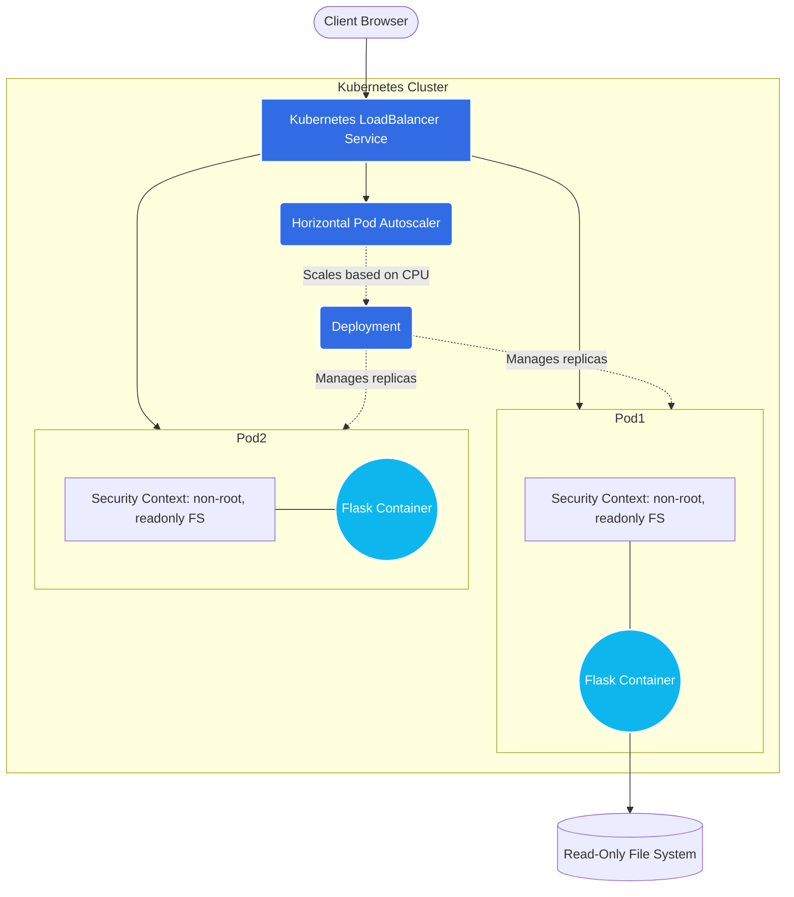
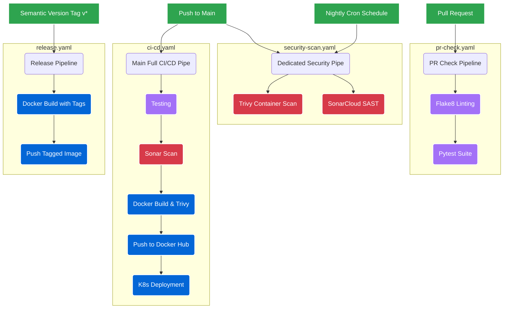

# DevSecOps Flask Project: Comprehensive Architecture & Documentation

## 1. Executive Summary
This project is a complete, production-ready **DevSecOps** showcase built around a cloud-native Python Flask application. It demonstrates the seamless integration of development, security, and operations by implementing a modern web dashboard backed by a REST API, fully automated testing, specialized CI/CD pipelines, containerization, and Kubernetes orchestration. 

The primary goal of the project is to illustrate **"Shift-Left" security principles**—catching vulnerabilities, code smells, and security hotspots early in the development lifecycle before code reaches production.

---

## 2. Complete System Architecture

The project is structured into three distinct operational layers. Below is the topology of how the system operates in a live environment.

### 2.1 Kubernetes & Container Architecture

### 2.2 Application Internal Architecture (Single Container)

The application itself is a unified monolith optimized for ease of deployment. The Flask backend natively serves the HTML static files alongside dynamic REST APIs.

---

## 3. Automation Layer (CI/CD Pipelines)

The project leverages GitHub Actions to orchestrate four highly specialized, parallel CI/CD workflows to ensure security and quality at every stage.

### 3.1 Pipeline Topology

### 3.2 Security Tooling Details
1. **SonarCloud (SAST)**: Statically analyzes the Python and JavaScript code for code smells, bugs, and security hotspots (e.g., hardcoded credentials, unsafe regex).
2. **Trivy (Container Security)**: Scans the built Docker images for Common Vulnerabilities and Exposures (CVEs) in base OS packages and Python dependencies. Fails the build if `CRITICAL` or `HIGH` vulnerabilities are found.

---

## 4. Deep-Dive Component Specifications

### 4.1 The Application Codebase (`backend/` & `frontend/`)
- **Backend Framework**: Python Flask. 
  - `app.py`: Contains the application factory, absolute path resolution for reliable static file serving from any directory, and error handling (404/500).
  - `test_app.py`: A `pytest` suite simulating 6 rigorous backend tests designed to ensure API stability and expected HTTP status codes.
- **Frontend Assets**: 
  - `index.html`: semantic markup for the web dashboard.
  - `style.css`: Modern, grid-based CSS with gradient styling and keyframe animations indicating live system health.
  - `script.js`: Uses the Fetch API to dynamically update the UI with data received from `/api/project`. It parses live test results (`6 passed, 0 failed`) directly into the UI.

### 4.2 Rest API Documentation
| Endpoint | Method | Purpose | Typical Response format |
|----------|--------|---------|-------------------------|
| `/` | GET | Serves the HTML dashboard | `text/html` |
| `/api/project` | GET | Aggregated data for the dashboard (Test stats, components) | `application/json` |
| `/api/pipelines`| GET | Returns metadata about the 4 GitHub Actions pipelines | `application/json` |
| `/health`| GET | Kubernetes readiness/liveness probe target | `{"status": "healthy"}` |
| `/api/info` | GET | App version and environment data | `{"version": "1.0.0"}` |

### 4.3 Containerization Strategy (`docker/Dockerfile`)
The Dockerfile is designed with production-grade security defaults:
1. **Multi-Stage Build**: Separates the dependencies build environment from the final execution environment to reduce the image payload and attack surface.
2. **Minimal Base Image**: Uses `python:3.9-slim`.
3. **Privilege Dropping**: Creates a user named `appuser` (UID 1001) and sets the `USER` directive. The application **does not** run as root inside the container.
4. **Optimized Layer Caching**: Installs `requirements.txt` before copying the codebase to maximize the effectiveness of Docker's layer cache during consecutive builds.

### 4.4 Kubernetes Manifests (`k8s/`)
The deployment targets high-availability and security within a cluster:
- **Deployment**: Configured with resource limits/requests (`500m` CPU, `256Mi` Mem). Enforces strict `securityContexts` (`readOnlyRootFilesystem: true`, `runAsNonRoot: true`). Uses `/health` for Liveness and Readiness probes.
- **Horizontal Pod Autoscaler (HPA)**: Automatically scales the deployment from 2 to 10 replicas if CPU utilization exceeds 70%.
- **ConfigMap & Secret**: Abstracts configuration (`APP_ENV=production`) away from the container image.

---

## 5. Development Workspace
- **Virtual Environment**: Recommends isolating via `python -m venv venv`.
- **VS Code Integration**: Implements a `.vscode/launch.json` file providing a `Run Flask App` debug task. This ensures the app is instantiated with the correct `cwd` (Current Working Directory), preventing path resolution errors when resolving the `frontend/` static assets.

## 6. Security Posture Summary
- **Code Level**: No hardcoded secrets. Uses environment variables and GitHub Secrets for API tokens.
- **Container Level**: Multi-stage builds reduce attack surface area; images drop root privileges immediately.
- **Cluster Level**: Kubernetes manifests enforce network separation, non-root execution, and read-only file systems.
